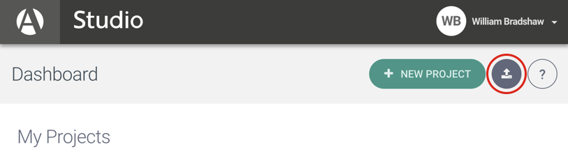

# Index IBM/Arria Workshop

During this workshop users will learn how to assemble and deploy a web application using IBM Cloud APIs and Arria NLG Studio. You will build up an application that takes an investment portfolio and evaluates what the holdings are worth in the current market. This data is then used to produce a report using natural language generation.

Building this application will show you how to:

* Create financial APIs on IBM Cloud
* Build and deploy NLG Studio applications that generate text
* Load and retrieve data from the Investment Portfolio service
* Analyse the portfolio's value using the Instrument Analytics service
* Generate narratives from the portfolio data with your NLG Studio API
* Chain these API calls together to make a node web app
* Deploy the application on IBM Cloud 

# The Application
In this tutorial you will build a web application that looks like this:

*TODO - update with logo*
<p align="center">
  
</p>

At the top of the screen you are able to select one of your investment portfolios. You can then use submit to analyse the portfolio and generate a report about it. The general workflow looks like this:

<p align="center">
  
</p>

The application is built around three main APIs:

## IBM Investment Portfolio
The IBM Investment Portfolio stores information about a user's investment portfolios, including how many holdings they have and in which companies.

## IBM Instrument Analytics
An API which takes in portfolio information and uses IBM Algorithmics pricing models to judge how much each holding is theoretically worth. This API supports all major asset classes, including equity, fixed income, forwards & futures, options, interest rate products, credit derivatives, indexes and structured products. Our application will use this analytics to value the holdings in the current financial market.
  
## Arria NLG Studio
Arria NLG Studio is a web application allowing users to build and deploy natural language generation systems. Studio can be used to produce reports for any vertical and follows a methodology that makes it easy to get started and natural to build up report complexity. We will use Studio to build an API that can describe the value of a portfolio. 

<!-- # Automatically Deploying the Application to IBM Cloud

[](https://bluemix.net/devops/setup/deploy?repository=https://github.com/robert-hodgson1/predictive-market-using-arria.git)

Be sure to [load investment portfolio](#5-load-investment-portfolio) before running the application. 
-->
# Workshop Code Along
Follow these steps to setup and run this project. The steps are described in detail below.

## Prerequisite
- [node](https://nodejs.org/en/)
- [npm](https://www.npmjs.com/)
- [an NLG Studio account](https://app.studio.arria.com)
- [an IBM Cloud developer account](https://www.ibm.com/cloud/)
- [IBM Cloud CLI](https://console.bluemix.net/docs/cli/reference/bluemix_cli/get_started.html#getting-started)

## Steps
1. [Clone the Repo](#1-clone-the-repo)
2. [Try the Application](#2-try-the-application)
3. [Generate Text with NLG Studio](#3-generating-text-with-nlg-studio)
4. [Create IBM Cloud Services](#4-create-ibm-cloud-services)
5. [Configure .env File](#5-configure-env-file)
6. [Load Investment Portfolios](#6-load-investment-portfolios)
7. [Run the Application Locally](#7-run-the-application-locally)
8. [Deploy to IBM Cloud](#8-deploy-to-ibm-cloud)


## 1. Clone the Repo

Clone the `index-arria-workshop` locally. In a terminal, run:
*TODO - location*
  `$ git clone https://github.com/XXXX/index-arria-workshop.git`


## 2. Try the Application

Before you get started, take a look at the end product we're going to put together. We have hosted the application at:

*TODO - Hosted URL*

Try generating text for the different portfolios, and see how the narrative changes.

## 3. Generating Text with NLG Studio

To generate the language in the application we use Arria NLG Studio. This web based development environment lets you write APIs that take in data and use it to produce narratives. We're going to load in the Studio project behind the application.

Firstly, log in to NLG Studio at <https://app.studio.arria.com>. If you haven't signed up yet, click the "Don't have an account button" and follow the instructions. Please note that the validation email can take a few minutes to come through.

Rather than creating the whole project from scratch, we are going to import a pre-built Studio project. Click the import a project button, which is next to new project. 

<p align="center">
  
</p>

The file we are going to load is in the git repository at `studio/nlgStudioProject.json`.

Once you have imported the project, click on it to open it up. You are taken to the Data screen of your project. This screen shows the sample data available to your project. 

To see how the system reacts using this data, try clicking the preview button on the left toolbar. 

Preview generates a report using the sample data. The top of the window shows the data, and the bottom shows the text. You can change the sample data and the report will reflect it. Try changing the name of the protfolio (currently "Portfolio") to something else, and preview the report. The first sentence should use your new name.

The text is composed through a series of scripts. Open the compose view to see the project's main script.  

TODO

To read more about NLG Studio, you can follow our tutorial which is available [here](https://docs.studio.arria.com/getting-started/creating-a-json-project/ "NLG Studio JSON Tutorial").

## 4. Create IBM Cloud Services

Our service is going to use three services from the IBM Cloud. Specifically, we are going to use:

* [**Investment Portfolio**](https://console.ng.bluemix.net/catalog/services/investment-portfolio)
* [**Instrument Analytics**](https://console.ng.bluemix.net/catalog/services/instrument-analytics)
* [**Arria Natural Language Generation APIs**](https://console.bluemix.net/catalog/services/natural-language-generation-apis)

For Investment Portfolio and Instrument Analytics, we are going to create them in the same way. Start by following the link and choose a service name, then click create in the bottom right.

Once you have created both APIs, you can visit them from the [**IBM Cloud dashboard**](https://console.bluemix.net/dashboard/apps). For each API, open it up and select Service Credentials from the right menu.

<p align="center">
  
</p>

These credentials are used to authorize usage of the IBM APIs. Click new credentials, choose a name, and click add. You can then click view credentials and see the credentials. You will need these in [step 5](#5-configure-env-file). 

The `Arria Natural Language Generation API` service is only needed when you are running the app in IBM Cloud. It gives you access to pre-built Arria NLG services and also lets you call your published NLG Studio project.

To create a link to your Studio project, follow the [Arria Natural Language Generation APIs](https://console.bluemix.net/catalog/services/natural-language-generation-apis) link and choose a name.

You also need to supply the URL and API for your published Studio service that you collected in [step 3](#3-generating-text-with-nlg-studio). Put these in the boxes provided and click create.

<p align="center">
  
</p> 

You have now got three services running on IBM Cloud. Now we are going to connect them together.

## 5. Configure .env file

We have provided a basic node web app that strings together calls between the various services. To know which services to connect, the app uses a `.env` file.

Create a `.env` file in the root directory of your clone of the project repository by copying the sample `.env.example` file using the following command:

  ```none
  cp .env.example .env
  ```

  **NOTE** Most files systems regard files with a "." at the front as hidden files.  If you are on a Windows system, you should be able to use either [GitBash](https://git-for-windows.github.io/) or [Xcopy](https://www.microsoft.com/resources/documentation/windows/xp/all/proddocs/en-us/xcopy.mspx?mfr=true)

The `.env` file will look something like the following:

  ```none  
  # Investment Portfolio
  CRED_PORTFOLIO_USERID_W=
  CRED_PORTFOLIO_PWD_W=
  CRED_PORTFOLIO_USERID_R=
  CRED_PORTFOLIO_PWD_R=
  CRED_PORTFOLIO_URL=

  # Instrument Analytics
  CRED_INSTRUMENT_ANALYTICS_URL=
  CRED_INSTRUMENT_ANALYTICS_ACCESSTOKEN=

  # Arria Natural Language Generation
  CRED_ARRIA_NATURAL_LANGUAGE_GENERATION_URL=
  CRED_ARRIA_NATURAL_LANGUAGE_GENERATION_TOKEN=
  ```
  
You will need to update the credentials with the IBM cloud credentials for each of the services you created in [Create IBM Cloud Services](#4-create-ibm-cloud-services).

## 6. Load Investment Portfolios

You will now need to create a portfolio in your Investment Portfolio service and create holdings for that portfolio. The `holdings.sample.json` file provides you with sample holdings for a portfolio.  You can run the `investmentPortfolio.js` script to load portfolio and holdings.  The credentials are retrieved from `.env` file so ensure that your Investment Portfolio credentials are filled as per the [last step](#5-configure-env-file).

We are going to use `investmentPortfolio.js` which acts as a wrapper around the Investment Portfolio service.

To load a portfolio named `MyFixedIncomePortfolio`, first install dependencies and use the command-line with the script to create the portfolio:
```
npm install
node investmentPortfolio.js -l MyFixedIncomePortfolio
```
This command produces a blank investment portfolio.

To populate this portfolio we are going to load holdings from `holdings.sample.json` into it, run:
```
node investmentPortfolio.js -l MyFixedIncomePortfolio -h holdings.sample.json
```

You can view a list of all of your portfolios by running:
```
node investmentPortfolio.js -g
```

To view the holdings within a portfolio run:
```
node investmentPortfolio.js -g MyFixedIncomePortfolio
```

If you make a mistake and want to delete a portfolio, you can run:

```
node investmentPortfolio.js -d MyFixedIncomePortfolio
```

## 7. Run the Application Locally

cd into this project's root directory
+ Run `npm install` to install the app's dependencies
+ Run `node app.js`
+ Access the running app locally


## 8. Deploy to IBM Cloud

Edit the `manifest.yml` file in the folder that contains your code and replace with a unique name for your application. The name that you specify determines the application's URL, such as `your-application-name.mybluemix.net`. Additionally - update the service names so they match what you have in Bluemix. The relevant portion of the `manifest.yml` file looks like the following:

  ```none
  applications:
  - path: .
    memory: 256M
    instances: 1
    domain: mybluemix.net
    name: arria-predictive-market
    host: arria-predictive-market
    disk_quota: 256M
    buildpack: sdk-for-nodejs
    services:
    - Investment-Portfolio
    - Instrument-Analytics
    - Arria-NLG-1
  ```

Once the manfiest.yml file is configured, you can push to IBM Cloud. From your root directory login into cf:
```
cf login
```
And push the app to IBM Cloud:
```
cf push
```

# Troubleshooting

* To troubleshoot your Bluemix application, use the logs. To see the logs, run:

```bash
cf logs <application-name> --recent
```


# License

[Apache 2.0](LICENSE)
