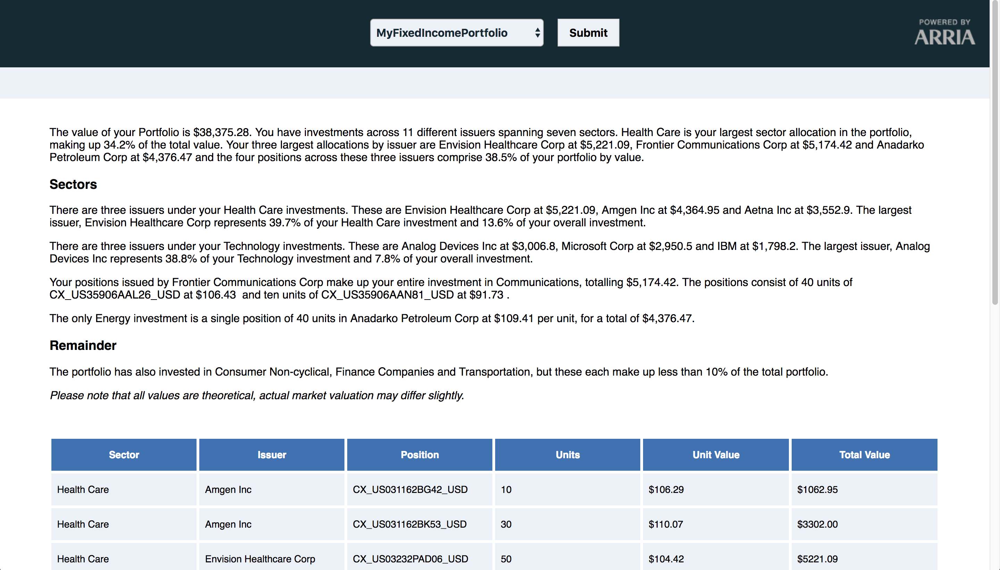
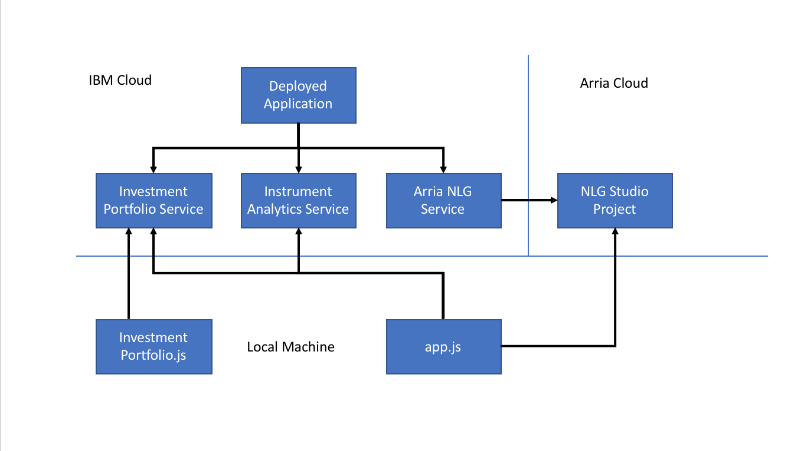
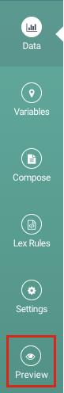
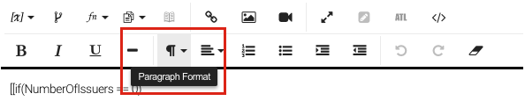
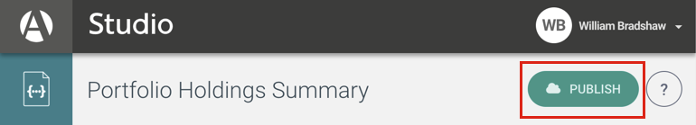
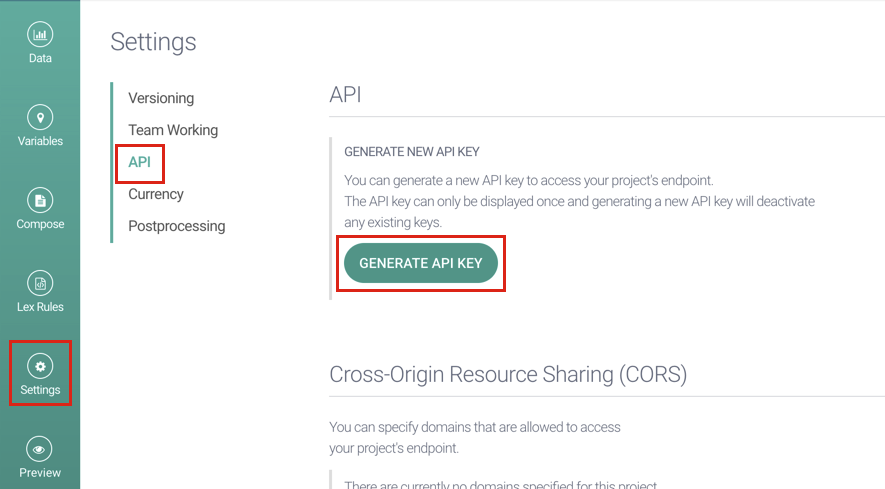
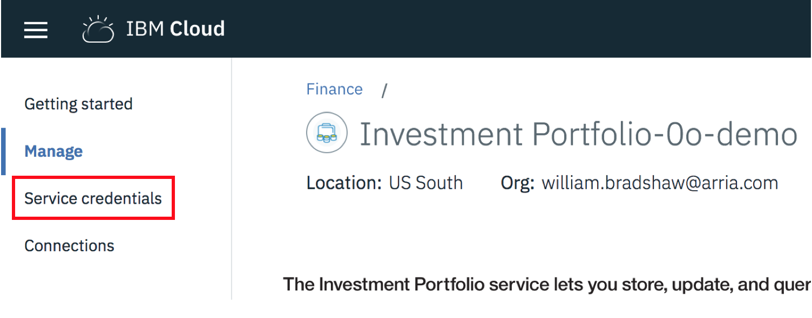
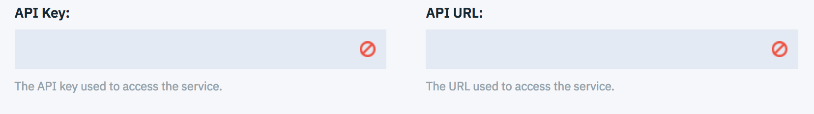
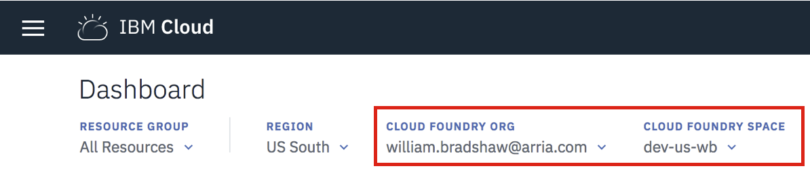
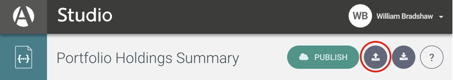

# Index IBM/Arria Workshop

During this workshop users will learn how to assemble and deploy a web application using IBM Cloud APIs and Arria NLG Studio. You will build up an application that takes an investment portfolio and evaluates what the holdings are worth in the current market. This data is then used to produce a report using natural language generation.

The workshop is broken into two halves:

* Setting Up the Application
* Expanding the Narrative

The first part will show you how to host the various services that make up our application, and the second will show you how you can expand the narrative using NLG Studio.  

Completing this workshop will show you how to:

- Create financial APIs on IBM Cloud
- Build and deploy NLG Studio applications that generate text
- Load and retrieve data from the Investment Portfolio service
- Analyse the portfolio's value using the Instrument Analytics service
- Generate narratives from the portfolio data with your NLG Studio API
- Chain these API calls together to make a node web app
- Deploy the application on IBM Cloud 

# The Application
In this tutorial you will build a web application that reports on the value of people's investment portfolios. An investment portfolio is a collection of stocks, options, and other holdings in various companies. These companies are referred to as the issuers of each holding. When we describe these issuers we tend to do so by business sector, e.g. Health Care, IT, Transport etc. 

The end application looks like this:

*TODO - update with logo*
<p align="center">
  
</p>

At the top of the screen you are able to select one of your investment portfolios. You can then use submit to analyse the portfolio and generate a report about it. The general workflow looks like this:

<p align="center">
  
</p>

The application is built around three main APIs:

## IBM Investment Portfolio
The IBM Investment Portfolio stores information about a user's investment portfolios, including how many holdings they have and in which companies. This service is able to catalogue changes in the portfolio over time, but in this demo we're just going to use the most recent data.

## IBM Instrument Analytics
An API which takes in portfolio information and uses IBM Algorithmics pricing models to judge how much each holding is theoretically worth. This API supports all major asset classes, including equity, fixed income, forwards & futures, options, interest rate products, credit derivatives, indexes and structured products. Instrument Analytics can calculate a lot of different factors about holdings. Our application will use this analytics to value the holdings in the current financial market.
  
## Arria NLG Studio
Arria NLG Studio is a web application allowing users to build and deploy natural language generation systems. Studio can be used to produce reports for any vertical and follows a methodology that makes it easy to get started and natural to build up report complexity. We will use Studio to build an API that can describe the value of a portfolio. 

<!-- # Automatically Deploying the Application to IBM Cloud

[](https://bluemix.net/devops/setup/deploy?repository=https://github.com/robert-hodgson1/predictive-market-using-arria.git)

Be sure to [load investment portfolio](#5-load-investment-portfolio) before running the application. 
-->
# Workshop A :  Setting Up the Application
This workshop will show you how to set up a web application on the IBM Cloud that combines IMB Cloud Financial Services with an Arria NLG Studio project.

## Prerequisite
- [node](https://nodejs.org/en/)
- [npm](https://www.npmjs.com/)
- [an NLG Studio account](https://app.studio.arria.com)
- [an IBM Cloud developer account](https://www.ibm.com/cloud/)
- [IBM Cloud CLI](https://console.bluemix.net/docs/cli/reference/bluemix_cli/get_started.html#getting-started)

## Steps
1. [Clone the Repo](#1-clone-the-repo)
2. [Try the Application](#2-try-the-application)
3. [Generate Text with NLG Studio](#3-generating-text-with-nlg-studio)
4. [Create IBM Cloud Services](#4-create-ibm-cloud-services)
5. [Configure .env File](#5-configure-env-file)
6. [Load Investment Portfolios](#6-load-investment-portfolios)
7. [Run the Application Locally](#7-run-the-application-locally)
8. [Deploy to IBM Cloud](#8-deploy-to-ibm-cloud)


## 1. Clone the Repo

Clone the `index-arria-workshop` locally. In a terminal, run:
*TODO - location*

  `$ git clone https://github.com/XXXX/index-arria-workshop.git`


## 2. Try the Application

Before you get started, take a look at the end product we're going to put together. We have hosted the application at:

https://demo-index-arria-app-wb.mybluemix.net/

Try generating text for the different portfolios, and see how the narrative changes.

## 3. Generating Text with NLG Studio

To generate the language in the application we use Arria NLG Studio. This web based development environment lets you write APIs that take in data and use it to produce narratives. We're going to load in the Studio project behind the application. 

Please note that NLG Studio is designed for Google Chrome. We strongly recommend using Chrome when building Studio applications. 

Firstly, log in to NLG Studio at <https://app.studio.arria.com>. If you haven't signed up yet, click the `Don't have an account` button and follow the instructions. The validation email can take a few minutes to come through.

Rather than creating the whole project from scratch, we are going to import a pre-built Studio project. The file we are going to load is in the git repository at `studio/nlgStudioProject.json`. Click the `Import a Project` button, which is next to new project. 

<p align="center">
  
</p>



Once you have imported the project, click on it to open it up. 

The purpose of NLG Studio is to build up an NLG application using scripts. This application can then be hosted on the Arria cloud, allowing you to post data to it and retrieve a corresponding narrative. 

When you open up a project, you are taken to the Data screen. This screen shows sample data that you can use to test your application. To see how the system reacts using this data, try clicking the `Preview` button on the left toolbar. 

Preview generates a report using the sample data. The top of the window shows the data, and the bottom shows the text. You can change the sample data and the report will reflect it. Try changing the name of the protfolio (currently "Sample Portfolio") to something else, and preview the report. The first sentence should use your new name. 

The text is composed using a series of scripts. Open the `Compose` view using the button on the left toolbar. You should see the `Main` script for your project. Whenever a narrative is generated, this is what runs. The script is written in ATL, Arria's Articulate Text Language. We will explain what ATL is, and how to write it, in the second workshop.

For now, all you need to know is that regular text in your script is included in your reports, while text enclosed with double square brackets will be calculated before being included. For example, the text as the bottom saying "Please note that all values are theoretical, actual market valuation may differ slightly." will appear as is. The if statement is in square brackets, so it will be evaluated and it will use a different description depnding on the number of issuers and sectors. 

Try adding a title to your report and preview what it looks like. You can use the formatting button if you want to style the title.

<p align="center">
  
</p>

Now we need to deploy your Studio application on the cloud. To do that, just click the `Publish` button in the top right. When it shows the success screen, copy down the app's URL.

<p align="center">
  
</p>

You project is now hosted at the URL in the dialogue window. If you forget the URL (or make changes to the project) you can publish at any time. This will update your existing URL.

To access that URL, you will also need an API key for authentication. This key is generated in the `Settings` menu by selecting the `API` submenu, and then pressing `GENERATE API KEY`. 

<p align="center">
  
</p>

We will need your URL and API key throughout the workshop. 

If you have a tool for hitting RESTful services like [Postman](https://www.getpostman.com/) or [cURL](https://curl.haxx.se/), you can try using the service. Your service is available through a `POST` request to your URL. You will need two headers:
- `ContentType = application/json`
- `Authorization = Bearer YOUR_API_KEY_HERE`

We have several example data sets in the `studio/api_data` folder. The structure for the data can be seen in the `studio/api_data/dataWrapper.json` file. If you do not send any data, NLG Studio will use the sample data. 

In Workshop B we are going to learn more about how to program in NLG Studio.

## 4. Create IBM Cloud Services

Our service is going to use three services from the IBM Cloud, two IBM financial services and a wrapper service around NLG Studio.

First we are going to set up the [**Investment Portfolio**](https://console.ng.bluemix.net/catalog/services/investment-portfolio) service which will store information about portfolios. Start by following the link and choose a service name, then click create in the bottom right.

Next, select Service Credentials from the right menu. If you have navigated away from the API, you can visit the [**IBM Cloud dashboard**](https://console.bluemix.net/dashboard/apps) and open the application.

<p align="center">
  
</p>

These credentials are used to authorize usage of the IBM APIs. Click new credentials, choose a name, and click add. You can then click view credentials and see the credentials. Copy them as you will need these in [step 5](#5-configure-env-file). 

Follow the same steps to set up [**Instrument Analytics**](https://console.ng.bluemix.net/catalog/services/instrument-analytics), which uses IBM Algorithmics' advanced financial analytics to evaluate the market price for different types of investment. Like the Investment Portfolio, you will need to take a copy of the credentials.

The `Arria Natural Language Generation API` service is only needed when you are running the app in IBM Cloud. It gives you access to pre-built Arria NLG services and also lets you call your published NLG Studio project.

To create a link to your Studio project, follow the [Arria Natural Language Generation APIs](https://console.bluemix.net/catalog/services/natural-language-generation-apis) link and choose a name.

You also need to supply the URL and API for your published Studio service that you collected in [step 3](#3-generating-text-with-nlg-studio). Put these in the boxes provided and click create.

<p align="center">
  
</p> 

You have now got three services running on IBM Cloud. Next we are going to connect them together.

## 5. Configure .env file

We have provided a basic node web app that strings together calls between the various services. To know how to connect to the services the app uses a `.env` file.

Create a `.env` file in the root directory of your project repository by copying the sample `.env.example` file with the following command:

  ```none
  cp .env.example .env
  ```

  **NOTE** Most files systems regard files with a "." at the front as hidden files.  If you are on a Windows system, you should be able to use either [GitBash](https://git-for-windows.github.io/) or [Xcopy](https://www.microsoft.com/resources/documentation/windows/xp/all/proddocs/en-us/xcopy.mspx?mfr=true)

The `.env` file will look like this:

  ```none  
  # Investment Portfolio
  CRED_PORTFOLIO_USERID_W=
  CRED_PORTFOLIO_PWD_W=
  CRED_PORTFOLIO_USERID_R=
  CRED_PORTFOLIO_PWD_R=
  CRED_PORTFOLIO_URL=

  # Instrument Analytics
  CRED_INSTRUMENT_ANALYTICS_URL=
  CRED_INSTRUMENT_ANALYTICS_ACCESSTOKEN=

  # Arria Natural Language Generation
  CRED_ARRIA_NATURAL_LANGUAGE_GENERATION_URL=
  CRED_ARRIA_NATURAL_LANGUAGE_GENERATION_TOKEN=
  ```
  
You will need to update the credentials with the IBM cloud credentials for each of the services you created in [Create IBM Cloud Services](#4-create-ibm-cloud-services).

These credentials do not need quotes. 

Pay particular attention to the Portfolio credentials. There are different credentials for reading (R) and writing (W).

## 6. Load Investment Portfolios

You will now need to create a portfolio in your Investment Portfolio service and create holdings for that portfolio. The `holdings.sample.json` file provides you with sample holdings for a portfolio.  You can run the `investmentPortfolio.js` script to load portfolio and holdings.  The credentials are retrieved from `.env` file so ensure that your Investment Portfolio credentials are filled as per the [last step](#5-configure-env-file).

To load a portfolio named `MyCustomPortfolio`, first install dependencies and use the command-line with the script to create the portfolio:
```
npm install
node investmentPortfolio.js -l MyCustomPortfolio
```
This command produces a blank investment portfolio.

To populate this portfolio we are going to load holdings from `holdings.sample.json` into it, run:
```
node investmentPortfolio.js -l MyCustomPortfolio -h holdings.sample.json
```

You can view a list of all of your portfolios by running:
```
node investmentPortfolio.js -g
```

To view the holdings within a portfolio run:
```
node investmentPortfolio.js -g MyCustomPortfolio
```

If you make a mistake and want to delete a portfolio, you can run:

```
node investmentPortfolio.js -d MyCustomPortfolio
```

## 7. Run the Application Locally

Now we can try running the whole application locally. The application is structured around `app.js`, a script that points to all of the resources in the web app. It gathers the values from the `.env` file and tells the system to use the HTML and javascript stored in the `public` folder. The code actually calling each endpoint is in `public/script/main.js`.

To launch the appication, run `node app.js` from the project's root directory. It will print out the port that the app is listening on. View the app by opening http://localhost:YOUR_PORT_NUMBER using the port that was printed in console. 

## 8. Deploy to IBM Cloud

Running the application locally lets you test things, but to go into production you need to deploy the app. We're going to use the IBM Cloud Command Line Interface to deploy the application with a few lines of code.

The `manifest.yml` file tells the IBM Cloud how to provision a server that hosts the app, and what services it needs to connect to. The current manifest file looks like this: 

  ```
applications:
- path: .
  memory: 128M
  instances: 1
  domain: mybluemix.net
  name: TODO
  host: TODO
  disk_quota: 128M
  buildpack: sdk-for-nodejs
  services:
  - Investment Portfolio-TODO
  - Instrument Analytics-TODO
  - Natural Language Generation APIs-TODO
  ```

You need to update the name and host, which tells your app what name it should be hosted under.

You also need to update the services list, making sure that the name for each service matches the name you created it with in the IBM Cloud. Check the [**IBM Cloud dashboard**](https://console.bluemix.net/dashboard/apps) to make sure the names match.

Once the manfiest.yml file is configured, you can push to IBM Cloud using the command line interface. The command line interface is accessed using `bx` like so:
```
bx login
```
You will need to supply your IBM Cloud user credentials. If you need to choose a region, choose US-South, the same region as your services.

Next you need to point the command line interface at your org and space. These are here in the Cloud dashboard.

<p align="center">
  
</p> 

Call the following command using your organisation and space.
```
bx target -o ORG -s SPACE
```

Now the command line interface can point to your application. 

To host our app, simply call
```
bx cf push
```

The console will include the URL that your app is hosted on. This will typically be `MANIFEST_HOST_VALUE.mybluemix.net`. Try visiting the URL and see your app running on the cloud.

# Workshop B : Expanding the Narrative
This workshop will take the application you built in Workshop A and give you the opportunity to expand the text with Arria's NLG Studio. This workshop is loosely structured, investigate anything you find interesting.

## Prerequisite
- [Workshop A](#workshop-a---setting-up-the-application)

## Steps
1. [Get More Sample Data](#1-get-more-sample-data)
2. [Learn NLG Studio](#2-learn-nlg-studio)
3. [Expanding the Text](#3-expanding-the-text)

## 1. Get More Sample Data
Currently you have one portfolio filled with sample data. However, we want to see how the system reacts in different situations. 

In [Load Investment Portfolios](#6-load-investment-portfolios) you learnt how to add a portfolio to your collection. Each portfolio you add is stored in the Investment Portfolio service you set up on the IBM Cloud, which means any portfolios you create are accessible. We have provided *TODO* more sample data files:

- TODO
- TODO
- TODO

Try creating portfolios for these files and see how the report changes. Portfolios are loaded when the page first loads, so refresh the app in your browser to see your additions.

You should notice that some of the samples, the ones with only a single issuer, don't produce a report. In this workshop you will write a script in NLG Studio for them.

## 2. Learn NLG Studio
We are going to write a script in NLG Studio to extend the text, so you will need to learn the basics of Studio. There are two options for getting started, and your choice depends on how ambitious you're feeling. 

* If you want to get started quickly, we have put together a short primer on NLG Studio. This is in the form of a Studio project, and it explains the most common actions. The primer project is in the git repository as `studio/studioDevelopersPrimer.json`. Import this project into NLG Studio in the same way you imported the other project.
* If you want a more in-depth guide to NLG Studio we have a full tutorial available on our documentation site at https://docs.studio.arria.com/getting-started/creating-a-json-project/. This tutorial will give you a step by step guide to building a new project.

## 3. Expand the Text
The report you downloaded is able to talk about the investment portfolio in most situations, unless there's only a single issuer. If all of your equity is in one company, the report will just print a line of canned text. You are going to expand this into a longer narrative. This is going to involve writing as well as coding. If you're ever stuck for ideas, you can try the https://demo-index-arria-app-wb.mybluemix.net/ demo to see how we phrased things.

First, an introduction in how the project is set up. A Studio project starts with a `Main` script, which can call out to various sub-scripts. In our Portfolio Holdings Summary project our `Main` script chooses what type of portfolio we are dealing with, then prints a canned text sentence. There are four types of report: NoIssuers, OneIssuer, ManyIssuersOneSector and ManyIssuersManySectors. It is the OneIssuer script we need to improve.

For us to test this, we're going to need some sample data. In the `studio/previewData` folder we have six sets of sample data:
- `SampleDataSet1` - The default portfolio with a number of different issuers across various sectors
- `SampleDataSet2` - An empty portfolio
- `SampleDataSet3` - A portfolio where all of the issuers are in the Technology sector
- `SingleIssuerSampleDataset1` - A portfolio with two separate holdings in a single issuer
- `SingleIssuerSampleDataset2` - A portfolio with a single holding in a single issuer
- `SingleIssuerSampleDataset3` - A portfolio with two separate holdings in a single issuer, where the vast majority of the holdings are in one of the holdings  

To load a sample dataset into Studio, visit the `Data` view and press the import data button.
 
<p align="center">
  
</p>

Load in one of the SingleIssuer sample datasets so we can see what we are working with. If you preview it you'll get the "You will fill in this template during the second part of the workshop" boilerplate text.

The project has already defined a few global variables which point to useful parts of the data. The two that will be most useful for you are ` [[PortfolioName]] ` and ` [[SortedIssuers]] `, or more specifically ` [[SortedIssuers[0]]] `. If you copy these into your script and preview it, you can see the data you have to hand.

Let's start with a basic sentence naming the portfolio and claiming that there is only a single issuer.

Once you've added a sentence and previewed it, you can re-publish it. As soon as it's republished, anyone using the demo you have hosted on the IBM Cloud will see the latest version of the text.

Next you could add the information that we'll always need:
- Who is the issuer?
- How many holdings are there? (i.e. the length of the issuer's values)
- What sector is the issuer in? (there are two ways of getting this, either from the first holding, or from the SortedSectors variable)

After that it would be good to read about the different holdings. There is a subscript called Position that takes a position in a holding (i.e. one of the issuer's values) that may come in handy.
  
It would make sense to describe the positions differently depending on how many holdings there are. Describing one holding is different to describing a portfolio made up of several holdings. You can use an if condition to choose from different options.

If you're describing multiple holdings, it would make sense to read them in value order. Try using the ` sort ` function. 

What happens if there are a lot of different holdings? You could try limiting the number of holdings using the ` top ` function.

What do you do if one of the holdings makes up the majority of the portfolio? In `SingleIssuerSampleDataset3` there are 5 units in one instrument, but 300 in the other.

The final thing to suggest is variation. You can use the ` chooseAtRandom ` function to make the report vary every time it is generated. If you want to vary something more complex, like a section of text including variables, it's usually easiest to put the choices in separate subscripts, and use ` chooseAtRandom ` to decide which to use. 

# License

[Apache 2.0](LICENSE)
